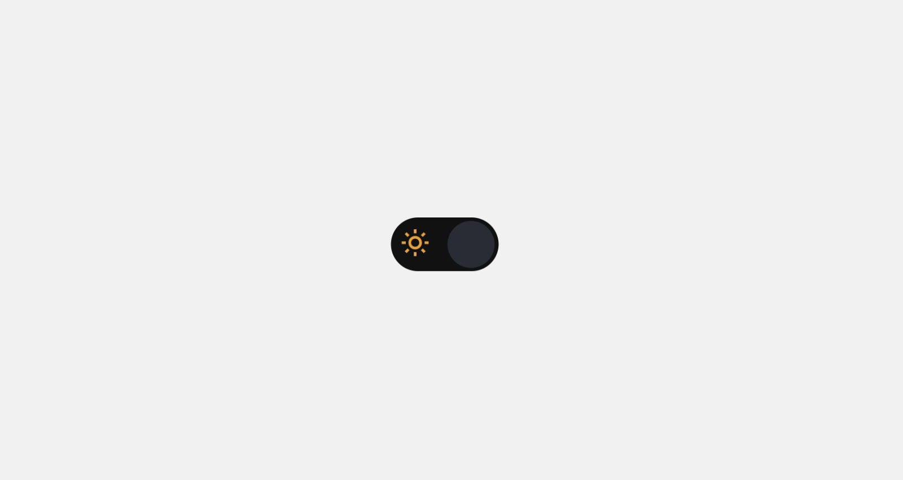
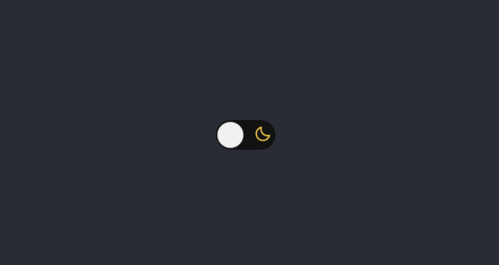

# Darkmode

Language: 
  
  

Coding Language/Framework: 
  
  
  

Tools: 
  
  
  

  
  

## Descrição

Olá a todos! Este projeto foi feito a partir de um interesse meu sobre como alterar o tema de uma página! Foi super divertido aprender à fazer o switch!

## Description

Hi all! This project was made due to my interest in how to alter the theme of a page! It was awesome learning how to make a switch from a checkbox!