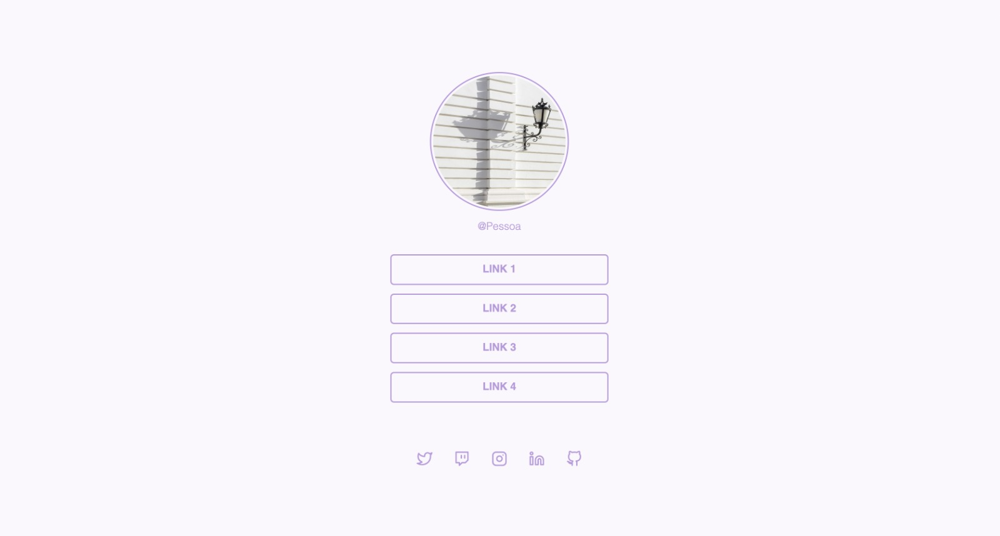

# Linktree

Language: 
  
  

Coding Language/Framework: 
  
  

Tools: 
  
  
  

  

## Descrição

Olá a todos! Este projeto foi feito a partir de um interesse de fazer um linktree baseado nos presentes do instagram!

## Description

Hi all! This project was made due to my interest in how to make a linktree like the ones in intagram!