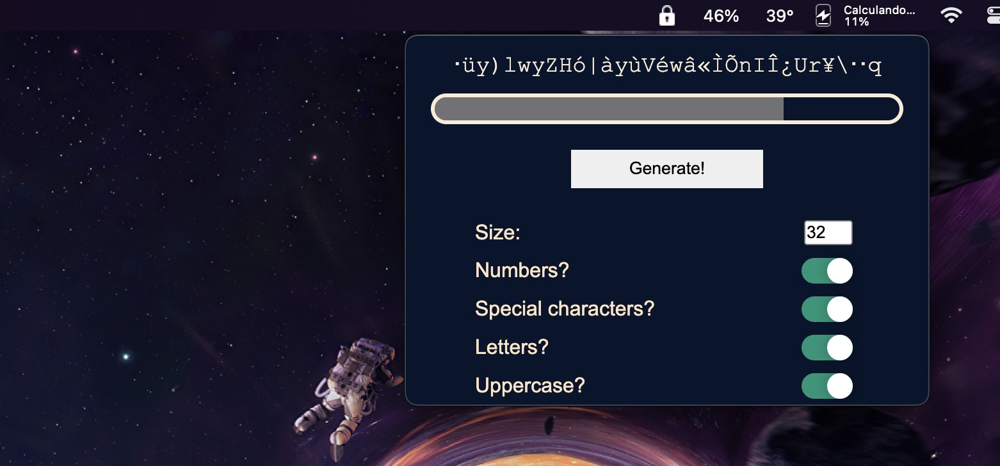

# Password Generator App

Language: 
  
  

Platform: 
  
  

Coding Language/Framework: 
  
  
  
  

Tools: 
  
  
  

  

## Descrição

Meu primeiro app usando Electron!

Eu o fiz por estar cansado de ter que criar senhas ***criativas*** e novas (rsrsrs).

Espero que gostem!

### Passos:

1. Depois de clonar, inicialize com "npm install"
2. Então use "npm run build" para criar um app em sua plataforma!
3. O resultado deverá estar em seu arquivo de downloads.

### Atenção!

O processo deverá levar alguns minutos, mas no fim, você deverá terminar com um aplicativo legal que gera senhas bem diversas!

Da forma que está, ele funcionará apenas em distribuições Linux e MacOS.

Ele funciona pela bandeija! Então quando rodar, tenha certeza de estar prestando atenção nela!

## Description

My first ever app using Electron!

i made it since i was tired of having to come up with new creative passwords lol.

Hope you enjoy it!

### Steps:

1. After cloning it, start npm with "npm install"
2. then use npm run build to build the app in your platform!
3. The outcome should be at your downloads folder.

### Attention!

The process should take some minutes to set up, but at the end, you should end up with a nice little app that generates very diverse passwords!

As it stands, it will only work on Linux distributions and MacOS

It works from the tray so whenever you run it, make sure to pay attention to it!
