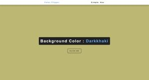
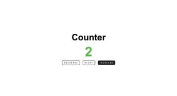
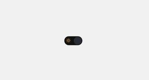
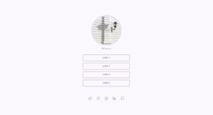
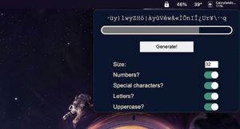
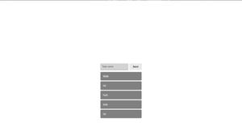

# Projects

Language: 
  
  

## Projetos

    <table>
    <thead>
        <tr>
            <th align="center">
                 
                

                    <small>#</small>
                

            </th>
            <th align="center">
                 
                
 
                    <small>NOME</small>
                

            </th>
            <th align="left">
                
                
 
                    <small>DATA DE LANÇAMENTO</small>
                

            </th>
            <th align="center">
                
                
 
                    <small>IMAGEM</small>
                

            </th>
        </tr>
    </thead>
    <tbody>
        <tr>
            <td>01</td>
            <td><a href="./colorFlipper">Color flipper</a></td>
            <td>31/03/2022 às 12:10</td>
            <td align="center">
            </td>
        </tr>
        <tr>
            <td>02</td>
            <td><a href="./counter">Contador!</a></td>
            <td>03/04/2022 às 11:09</td>
            <td align="center">
            </td>
        </tr>
        <tr>
            <td>03</td>
            <td><a href="./Darkmode">Darkmode!</a></td>
            <td>07/04/2022 às 13:01</td>
            <td align="center">
            </td>
        </tr>
        <tr>
            <td>04</td>
            <td><a href="./Linktree">Linktree</a></td>
            <td>07/04/2022 às 18:42</td>
            <td align="center">
            </td>
        </tr>
        <tr>
            <td>05</td>
            <td><a href="./Password-Generator">Gerador de senhas!</a></td>
            <td>08/04/2022 às 10:21</td>
            <td align="center">
            </td>
        </tr>
        <tr>
            <td>06</td>
            <td><a href="./tasks">Task List</a></td>
            <td>11/04/2022 às 10:47</td>
            <td align="center">
            </td>
        </tr>
    </tbody>
</table>
 

## Projects

    <table>
    <thead>
        <tr>
            <th align="center">
                 
                

                    <small>#</small>
                

            </th>
            <th align="center">
                 
                
 
                    <small>NAME</small>
                

            </th>
            <th align="left">
                
                
 
                    <small>RELEASE DATE</small>
                

            </th>
            <th align="center">
                
                
 
                    <small>PREVIEW</small>
                

            </th>
        </tr>
    </thead>
    <tbody>
        <tr>
            <td>01</td>
            <td><a href="./colorFlipper">Color flipper</a></td>
            <td>31/03/2022 at 12:10PM</td>
            <td align="center">
            </td>
        </tr>
        <tr>
            <td>02</td>
            <td><a href="./counter">Contador!</a></td>
            <td>03/04/2022 at 11:09AM</td>
            <td align="center">
            </td>
        </tr>
        <tr>
            <td>03</td>
            <td><a href="./Darkmode">Darkmode!</a></td>
            <td>07/04/2022 at 01:01PM</td>
            <td align="center">
            </td>
        </tr>
        <tr>
            <td>04</td>
            <td><a href="./Linktree">Linktree</a></td>
            <td>07/04/2022 at 06:42PM</td>
            <td align="center">
            </td>
        </tr>
        <tr>
            <td>05</td>
            <td><a href="./Password-Generator">Gerador de senhas!</a></td>
            <td>08/04/2022 at 10:21AM</td>
            <td align="center">
            </td>
        </tr>
        <tr>
            <td>06</td>
            <td><a href="./tasks">Task List</a></td>
            <td>11/04/2022 at 10:47AM</td>
            <td align="center">
            </td>
        </tr>
    </tbody>
</table>

