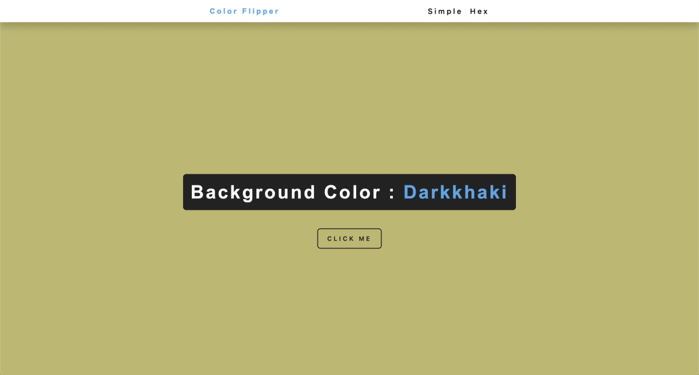
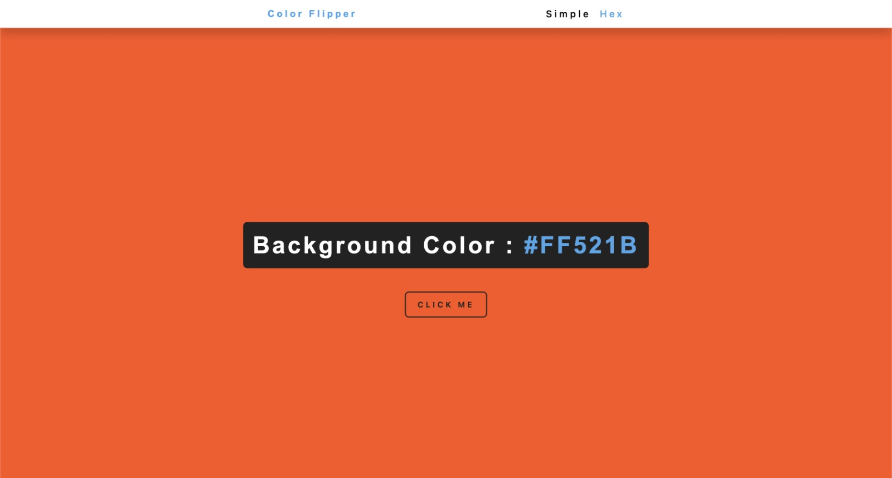

# Meme Generator

Language: 
  
  

Coding Language/Framework: 
  
  
  

Tools: 
  
  
  

  
  

## Descrição

Este projeto foi feito com base do projeto do canal freecodecamp!
link: https://youtu.be/3PHXvlpOkf4

Eu não cheguei à acompanhar o vídeo, me desafiando na criação completa do processo! E deixa eu te contar, que experiência!

### Base:
https://vannilla-js-basic-project-1-background-color.netlify.app/

### Practiced:
    1. Condições ternárias
    2. Configurações atributos pelo Javascript
    3. Navegando árvore de itens

## Description

This has been part of a project from freecodecamp's yt channel!
link: https://youtu.be/3PHXvlpOkf4

I haven't really followed the video, so I can better challenge myself to make it from the ground up, and I gotta say, it was an awesome experience!

### Base:
https://vannilla-js-basic-project-1-background-color.netlify.app/

### Practiced:
    1. ternary conditions
    2. setting attributes from javascript
    3. navigating a tree