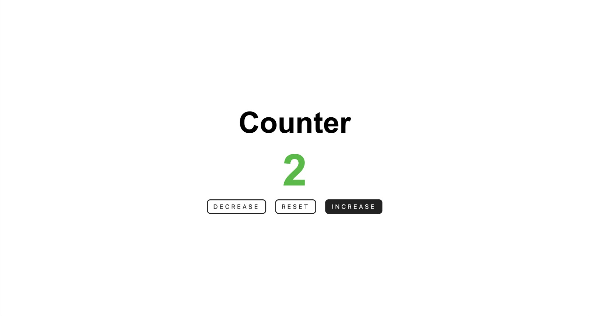
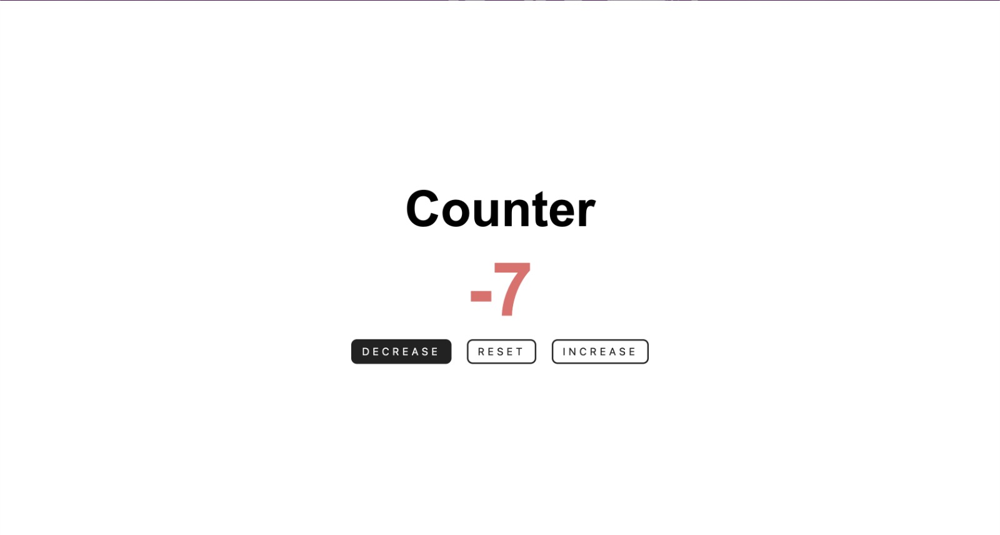

# Counter

Language: 
  
  

Coding Language/Framework: 
  
  
  

  
  

## Descrição

Olá à todos! Este é um dos primeiros e mais clássicos projetos que cada desenvolvedor já fez pelo menos uma vez! Este tem a capacidade de todos os números inteiros.

## Description

Hi all! This has to be one of the most iconic projects every developer has ever done! This one in particular, has the ability to go over ever intenger value, including negative ones!
