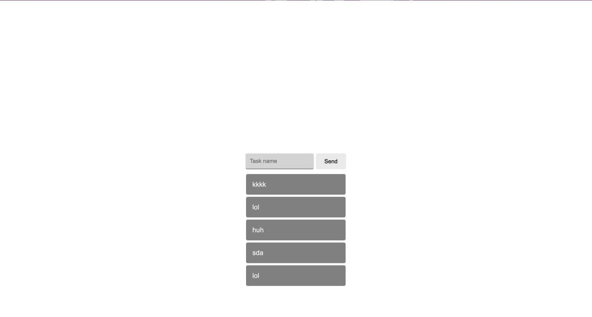
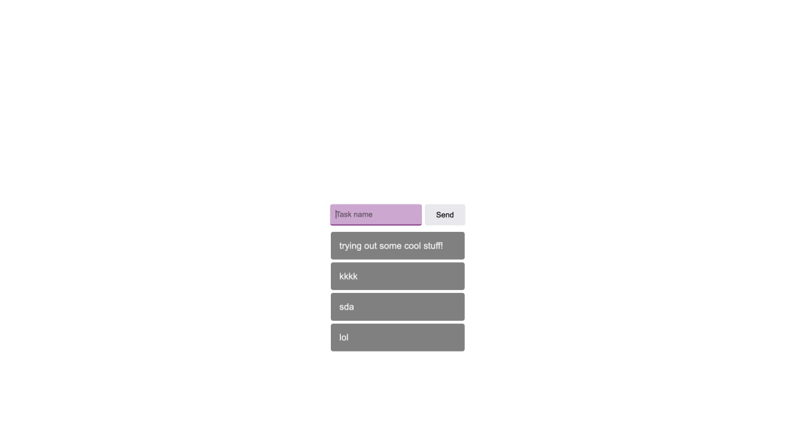

# Task-list!

Language: 
  
  

Coding Language/Framework: 
  
  
  
   
  
  

Tools: 
  
  
  

  
  

## Descrição

Meu primeiro app usando API interna!

Um legal, simples e persistente lista de àfazeres!

Espero que gostem!

### Passos:

1. Depois de clonar, inicialize com "npm install"
2. Depois escreva "npm run start"
3. Acesse a porta aberta (normalmente demonstrado pelo terminal) com localhost

### Atenção!

O processo, em geral, levará alguns instantes, e no final, deverá ser acessível via: http://localhost:{PORT APRESENTADO NO TERMINAL AQUI}/

## Description

My first ever app using an internal API!

A nice and simple persistant task list!

Hope you enojoy it!

### Steps:

1. After cloning in, initialize with "npm install"
2. Then, write "npm run start"
3. Acess the port displayed on terminal by localhost (more info on how bellow!)

### Warning!

The process, in general, will take a few instants, and at the end, should be accessable via: http://localhost:{PORT displayed on terminal}/